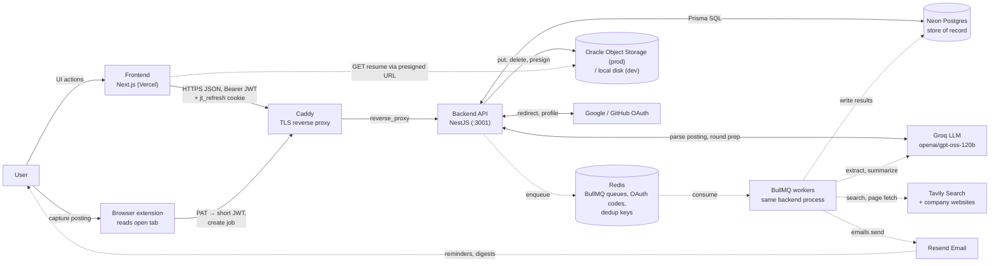
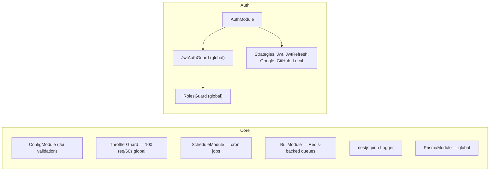
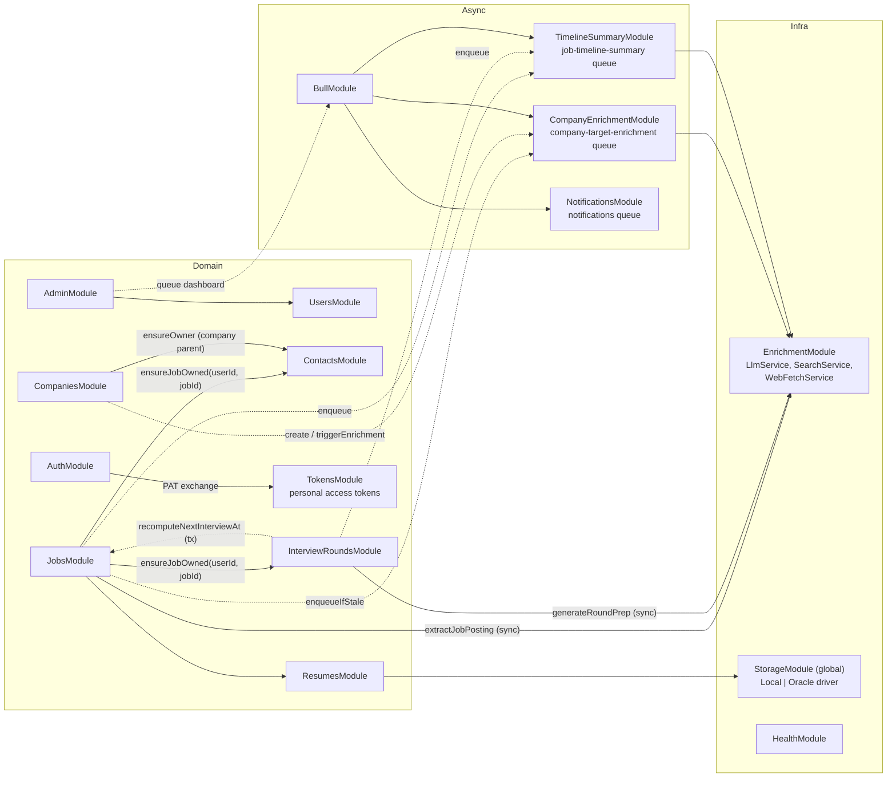
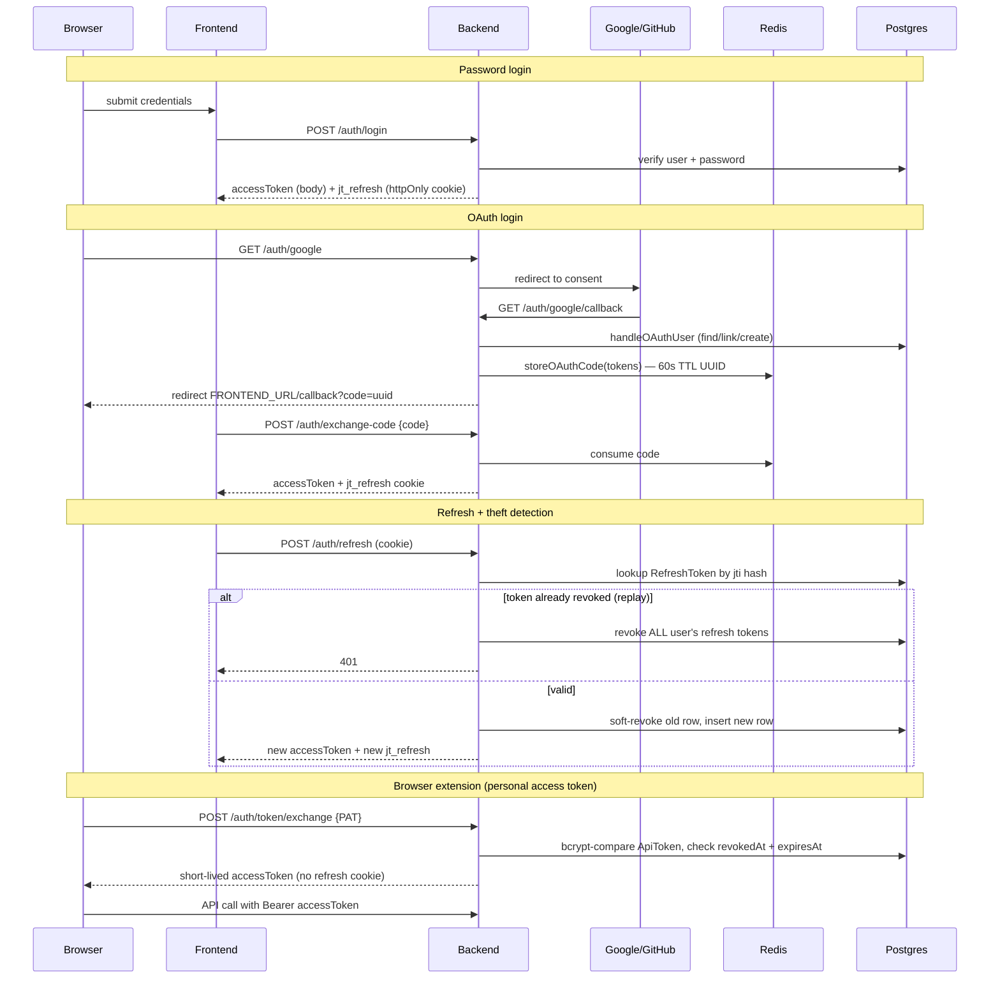
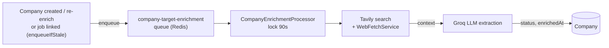
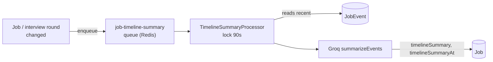
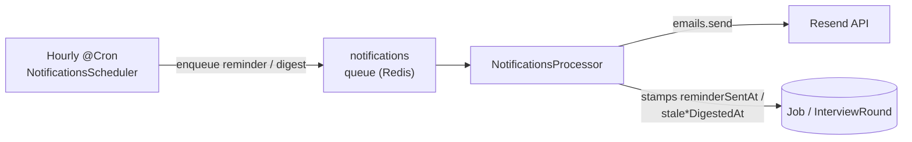
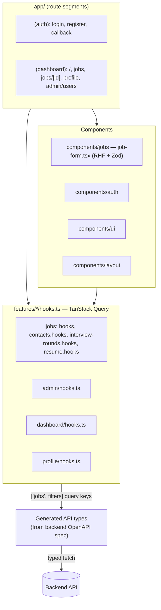
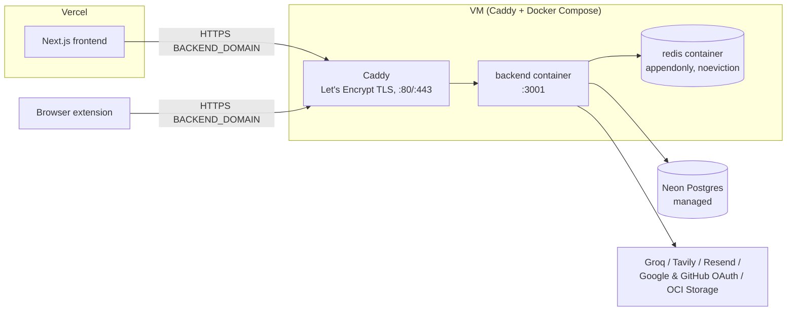

# Architecture

System-level diagrams. For state and sequence diagrams of individual flows see [`uml.md`](./uml.md). For DB schema detail see [`database-schema.md`](./database-schema.md); for backend/frontend internals see [`backend-overview.md`](./backend-overview.md) and [`frontend-overview.md`](./frontend-overview.md).

## System context and data flow

Solid arrows run inside a request; dotted arrows run in BullMQ workers or bypass the API. Postgres is the only store of record — Redis holds work in flight. A published visual version of this page lives at <https://claude.ai/artifact/XE3NMk5ubDKpuLh1LnMUXm>.

## Backend module map (NestJS)

### Core and auth

### Feature modules

## Auth flow — JWT + OAuth

Daily at midnight, `AuthService` deletes expired `RefreshToken` rows and `TokensService` deletes expired `ApiToken` rows.

## Async pipelines — enrichment, timeline summary & notifications (BullMQ)

### Company enrichment

### Timeline summary

### Notifications

Company enrichment moves `status` through PENDING → PROCESSING → COMPLETED / FAILED.

`EmailService` no-ops (logs only) when `RESEND_API_KEY` is unset — app still boots.

## Frontend structure (Next.js App Router)

Query/mutation logic lives in `features/*/hooks.ts`, not in route pages or components — route pages hold local UI state only.

## Deployment topology

