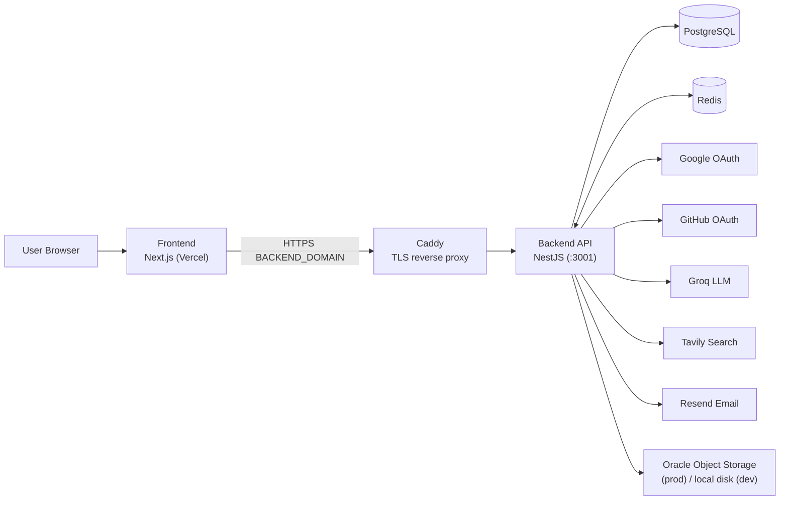
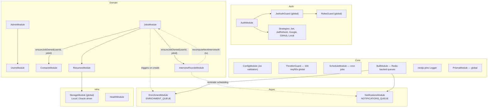
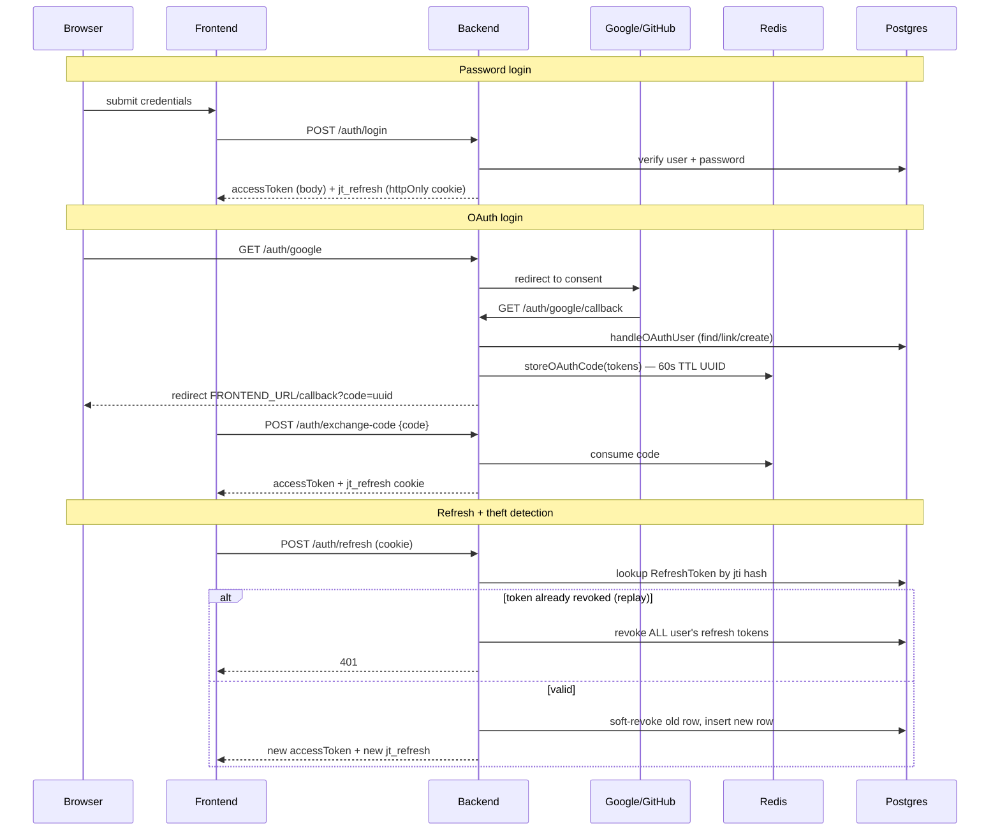
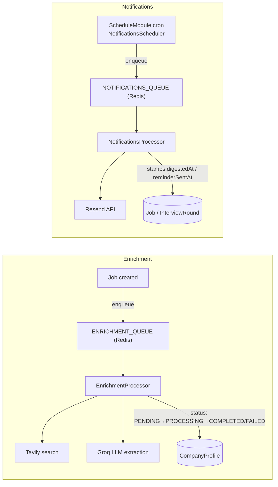
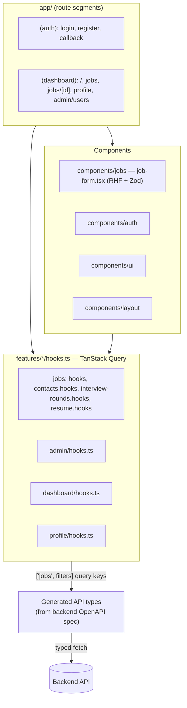
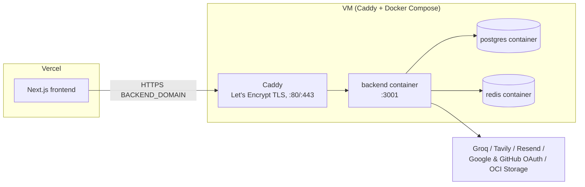

# Architecture

System-level diagrams. For DB schema detail see [`database-schema.md`](./database-schema.md); for backend/frontend internals see [`backend-overview.md`](./backend-overview.md) and [`frontend-overview.md`](./frontend-overview.md).

## System context

## Backend module map (NestJS)

## Auth flow — JWT + OAuth

## Async pipelines — enrichment & notifications (BullMQ)

`EmailService` no-ops (logs only) when `RESEND_API_KEY` is unset — app still boots.

## Frontend structure (Next.js App Router)

Query/mutation logic lives in `features/*/hooks.ts`, not in route pages or components — route pages hold local UI state only.

## Deployment topology

