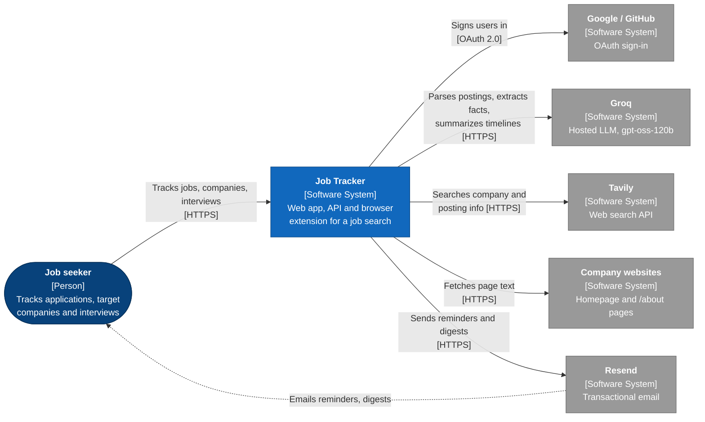
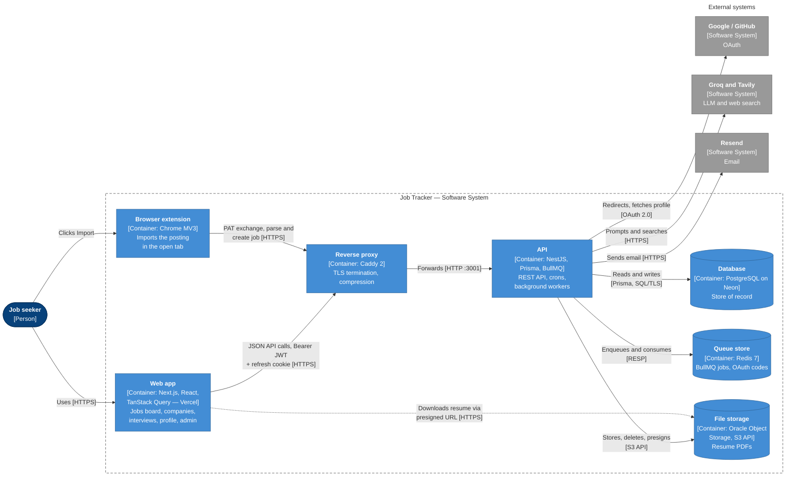
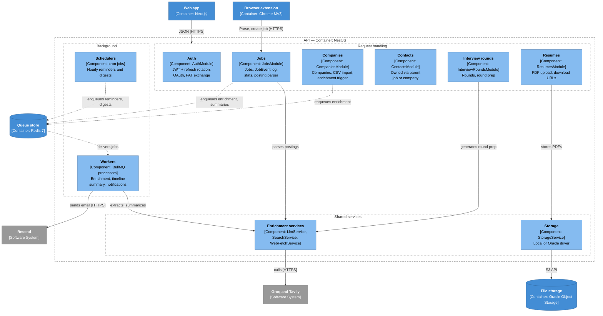

# C4 model

Job Tracker's architecture at the first three [C4](https://c4model.com) levels: system context, containers, and the components inside the API. The code level is left out — the source is the reference. For request-level flows see [`architecture.md`](./architecture.md) and [`uml.md`](./uml.md).

A hand-drawn version of the same three levels, with light and dark themes, is on the data flow page: [context](https://claude.ai/artifact/XE3NMk5ubDKpuLh1LnMUXm#c4), [containers](https://claude.ai/artifact/XE3NMk5ubDKpuLh1LnMUXm#c4-containers), [components](https://claude.ai/artifact/XE3NMk5ubDKpuLh1LnMUXm#c4-components) (private; needs the owner's claude.ai sign-in).

The diagrams use Mermaid flowcharts styled with C4 conventions rather than Mermaid's experimental `C4Context` syntax, whose automatic layout overlaps labels on GitHub. Every box names its element type in brackets; colours follow the usual C4 key:

- Dark blue — person
- Blue — Job Tracker itself (system, container)
- Light blue — component
- Grey — external system
- Dashed border — system or container boundary

## Level 1 — System context

Who uses Job Tracker and which outside systems it depends on.

## Level 2 — Containers

The separately deployed or data-holding parts of Job Tracker. Deployment detail (VM, Docker Compose, Vercel) is in [`architecture.md`](./architecture.md#deployment-topology).

## Level 3 — Components of the API

NestJS modules inside the API container. Every feature module reads and writes Postgres through the global `PrismaService`; those arrows are left out to keep the diagram readable.

Tokens, users, admin and health modules are omitted.
