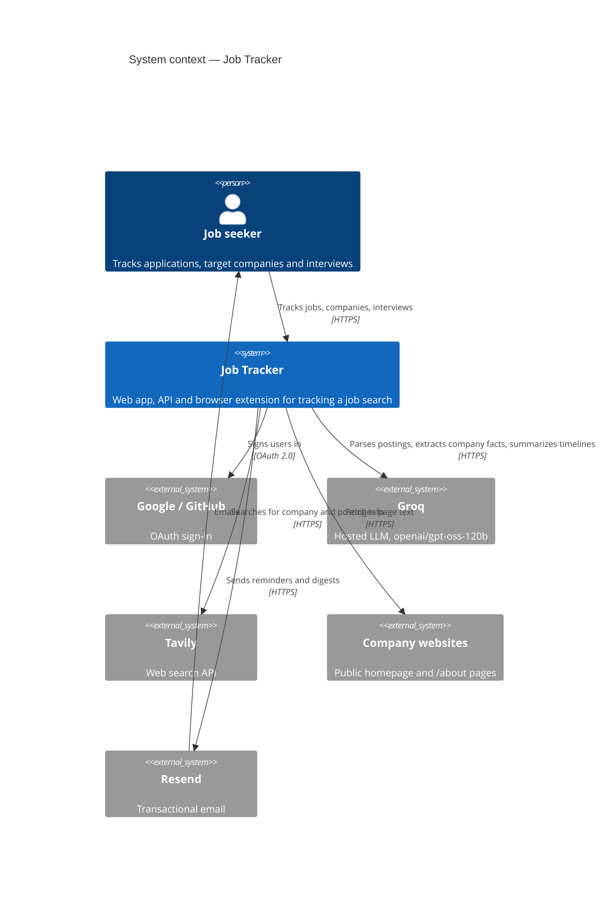
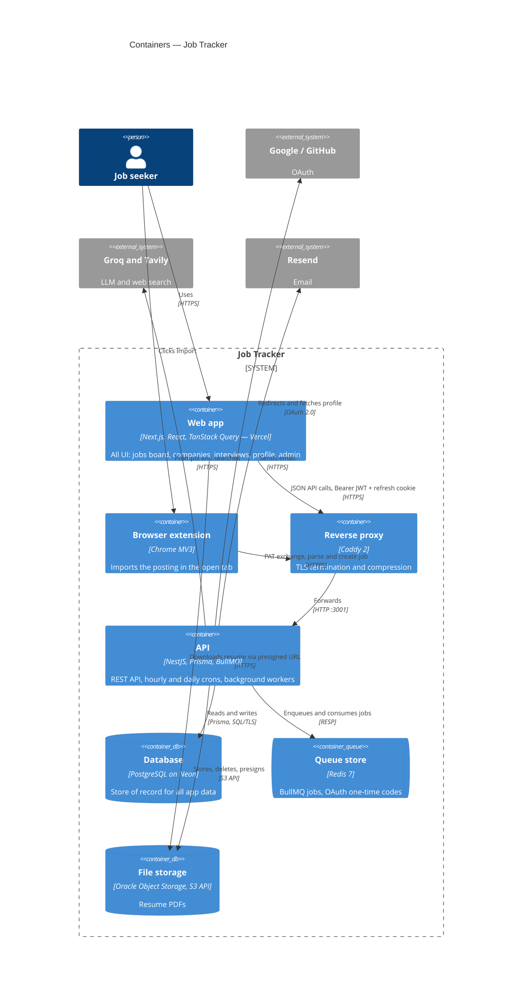
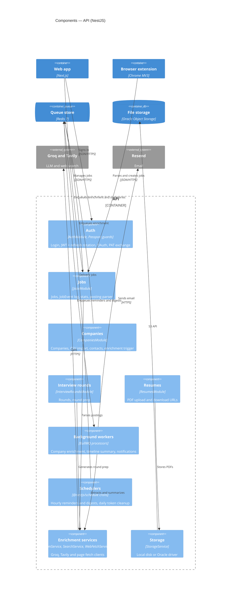

# C4 model

Job Tracker's architecture at the first three [C4](https://c4model.com) levels: system context, containers, and the components inside the API. The code level is left out — the source is the reference. For request-level flows see [`architecture.md`](./architecture.md) and [`uml.md`](./uml.md).

## Level 1 — System context

Who uses Job Tracker and which outside systems it depends on.

## Level 2 — Containers

The separately deployed or data-holding parts of Job Tracker. Deployment detail (VM, Docker Compose, Vercel) is in [`architecture.md`](./architecture.md#deployment-topology).

## Level 3 — Components of the API

NestJS modules inside the API container. Every feature module reads and writes Postgres through the global `PrismaService`; those arrows are left out to keep the diagram readable.

Contacts belong to `CompaniesModule` in this diagram for brevity; in code they are their own `ContactsModule`, owned through a parent job or company. Tokens, users, admin and health modules are omitted.
