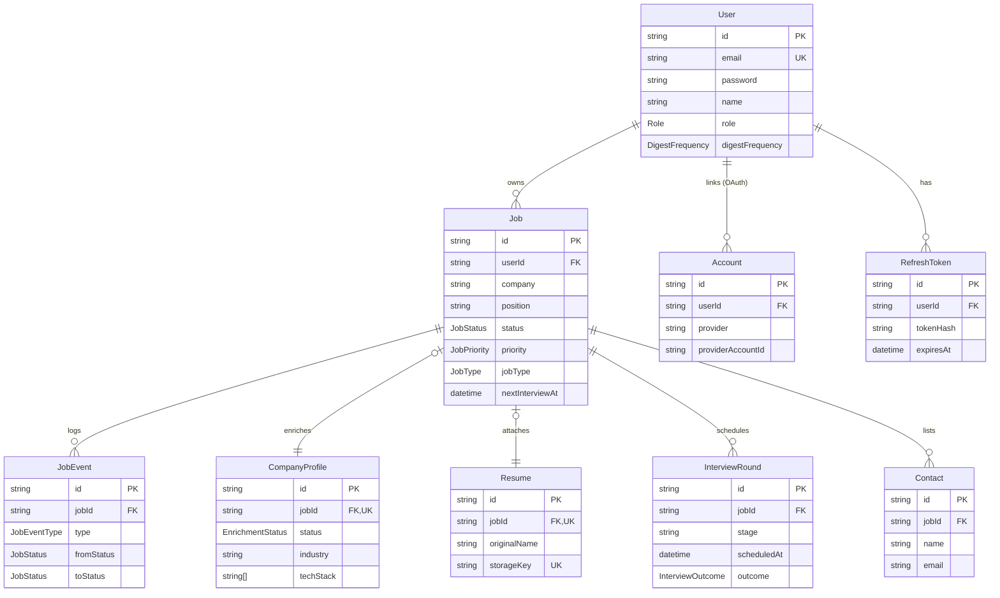

# Database Schema

All child tables (`Job`, `Account`, `RefreshToken`) cascade-delete on `User` removal; all `Job`-child tables (`JobEvent`, `CompanyProfile`, `Resume`, `InterviewRound`, `Contact`) cascade-delete on `Job` removal. `CompanyProfile` and `Resume` are 1:1-optional (unique `jobId`); `InterviewRound`, `Contact`, `JobEvent` are 1:many. See `backend/prisma/schema.prisma` for the full source of truth.
