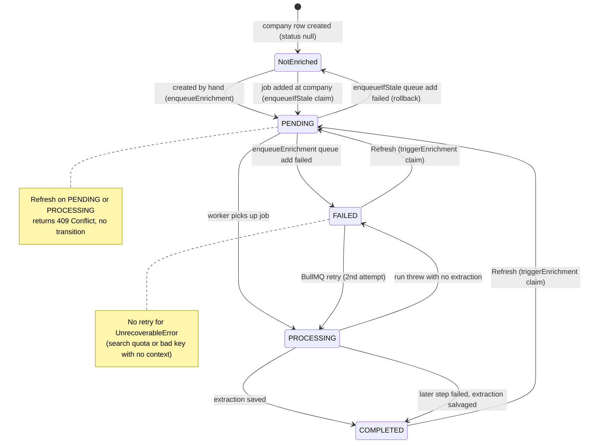
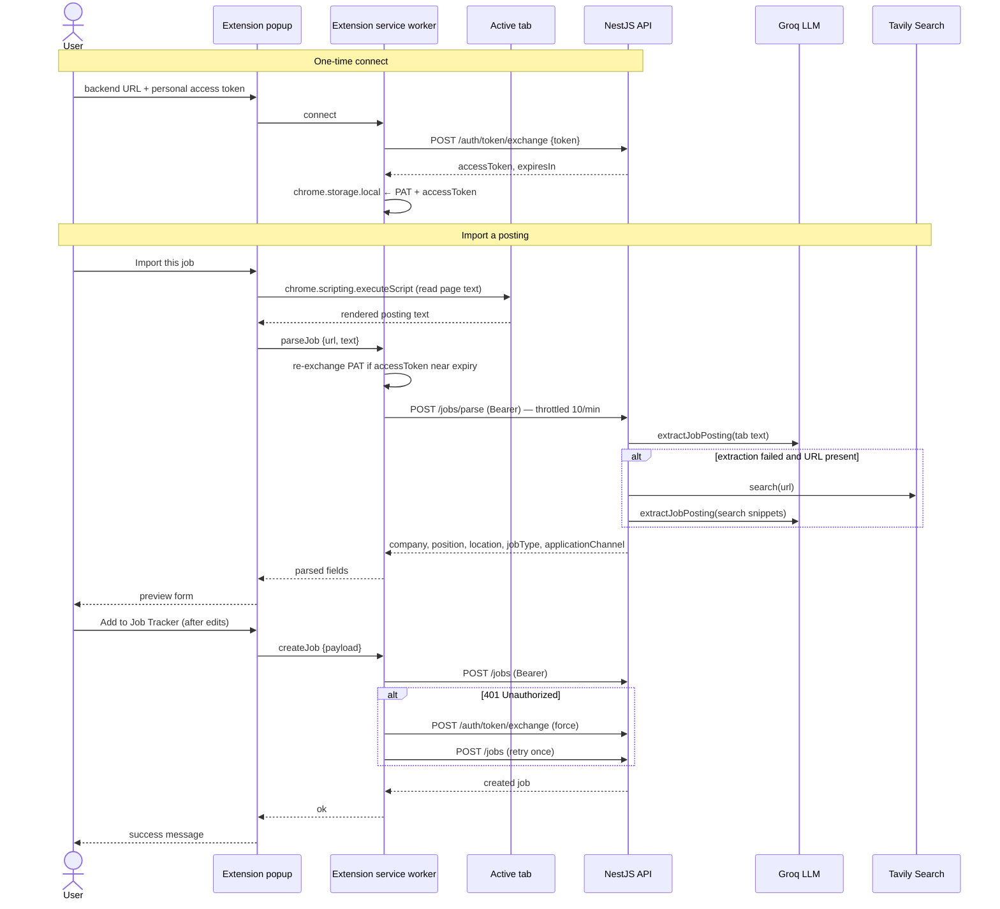
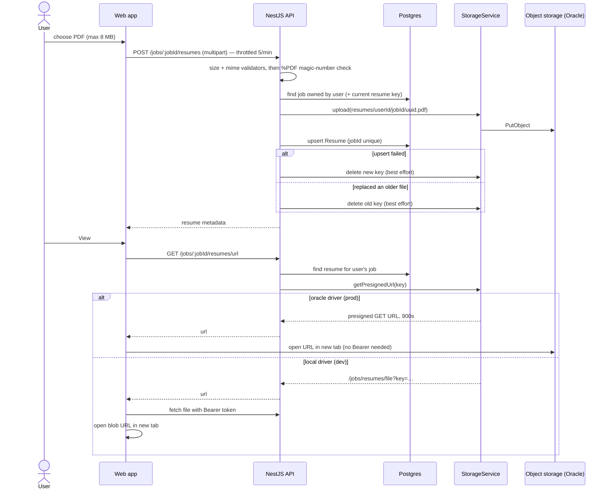
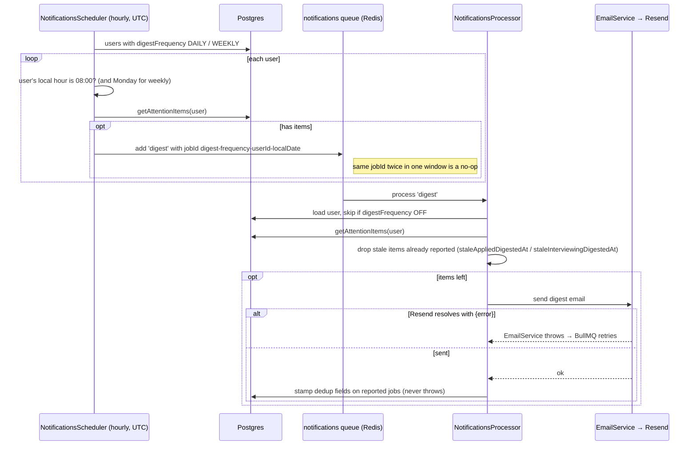

# UML diagrams

Behavioural diagrams for flows whose rules live in code. For the system-level views see [`architecture.md`](./architecture.md); for the schema see [`database-schema.md`](./database-schema.md).

## Company enrichment status (state diagram)

`Company.status` (`EnrichmentStatus`, nullable). Transitions are enforced by compare-and-swap `updateMany` claims in `CompaniesService.triggerEnrichment` and `CompanyEnrichmentService`, and by status writes in `CompanyEnrichmentProcessor`.

`enqueueIfStale` only claims `NotEnriched` companies, so adding more jobs at a COMPLETED or FAILED company never re-runs enrichment (ADR-035). Only the Refresh button does. A company deleted mid-run is left alone: the worker checks the row still exists before writing.

## Capture a job with the browser extension (sequence diagram)

Tab text wins over a server-side fetch of the URL: sites like LinkedIn answer the server with a logged-out page. A `403` from the token exchange means the PAT was revoked, so the service worker clears the stored connection.

## Resume upload and view (sequence diagram)

## Notification digest (sequence diagram)

Stamping happens only after a successful send, so a failed or retried send still includes the items next time. A stamp failure is logged, not thrown: the email already went out, and a BullMQ retry would send it twice.
